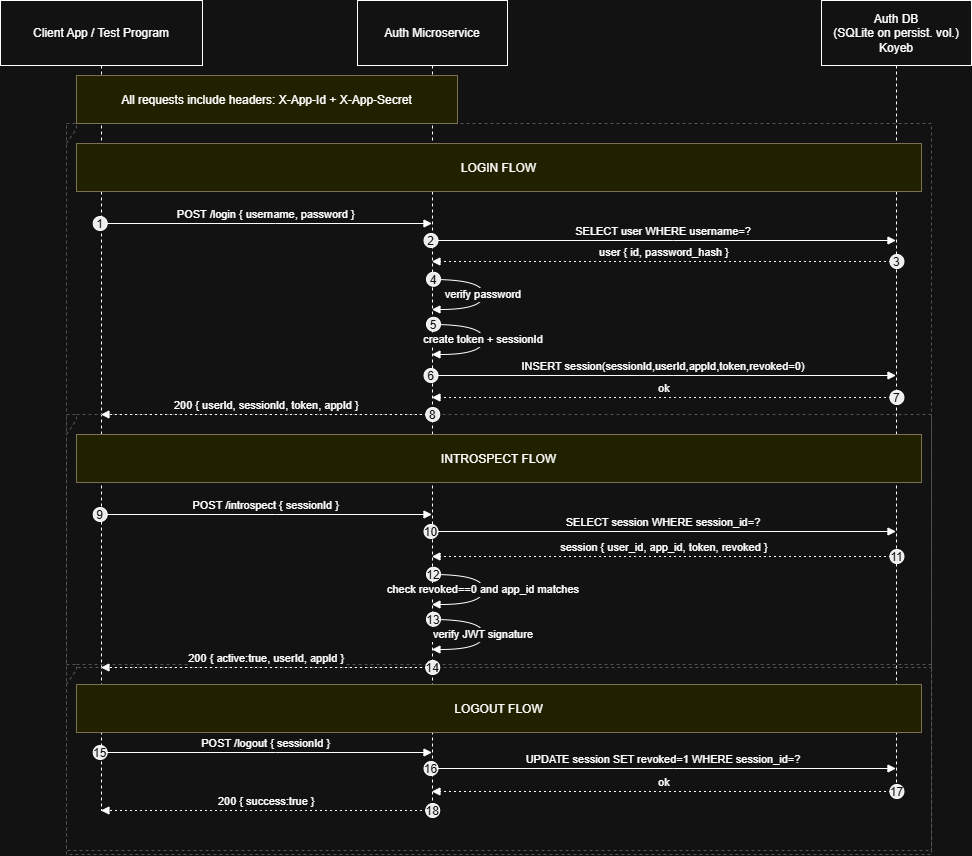

# cs361-auth-microservice — CS361 Sprint 2

## A. What this microservice does

This is the auth microservice for our CS361 small pool project. It’s meant to be called by any app in our system via HTTP.

It supports:

- **Signup**: create a user account, hash password, create a session, return JWT token
- **Login**: authenticate username/password, create a session, return JWT token
- **Logout**: revoke a session (invalidate the sessionId)
- **Introspect**: server-to-server session validation so downstream apps can obtain userId

Any client that can send HTTP requests can use it.

---

## Setup / Run (Local)

**NOTE**
If you see a 401, double-check your `X-App-Id` / `X-App-Secret` headers match `APP_SECRETS`.

### 1. Create + activate a virtual environment (Windows Git Bash)

```bash
python -m venv .venv
source .venv/Scripts/activate
```

### 2. Install dependencies

```bash
python -m pip install --upgrade pip
pip install -r requirements.txt
```

### 3. Configure environment variables

Create a `.env` file (**do not commit it**). Use `.env.example` as a template.

Required:

- `JWT_SECRET`
- `APP_SECRETS` (comma-separated `appId:clientSecret` pairs)

Optional:

- `DB_PATH` (defaults to `auth.db`)

### 4. Run the service

```bash
python app.py
```

Health check:

```bash
curl http://127.0.0.1:5000/health
```

### Token behavior

JWTs are intentionally configured to **not expire**. Access is controlled via:

- server-side session records (`sessionId`)
- `POST /logout` (revokes a session)
- `POST /introspect` (validates a session and returns `userId` for downstream filtering)

### Hosting notes (Koyeb)

For Koyeb deployments, run with Gunicorn and set environment variables in the Koyeb dashboard (do not commit `.env`).

**Run command (Koyeb / production-style):**

```bash
gunicorn app:APP --bind 0.0.0.0:$PORT
```

**If using a Koyeb Volume for SQLite persistence:**

- Mount the volume at `/data`
- Set: `DB_PATH=/data/auth.db`
- Keep the service at **1 instance** (SQLite is a single-file DB)

---

## Communication Contract

### Base URL

Local:

- `http://127.0.0.1:5000`

### All endpoints accept/return JSON.

- Use `Content-Type: application/json`
- Send and receive JSON bodies

### Required headers (for all protected endpoints)

All endpoints below require:

- `X-App-Id: <appId>`
- `X-App-Secret: <clientSecret>`

Example:

- `X-App-Id: workouts-app`
- `X-App-Secret: abc123`

---

## Endpoints

### 1. POST /signup

Request JSON:

```json
{
  "username": "demo_user",
  "password": "password123"
}
```

Example (curl):

```bash
curl -X POST http://127.0.0.1:5000/signup \
-H "Content-Type: application/json" \
-H "X-App-Id: workouts-app" \
-H "X-App-Secret: abc123" \
-d '{"username":"demo_user","password":"password123"}'
```

Response (201):

```json
{
  "userId": 1,
  "sessionId": "uuid-string",
  "token": "jwt-string",
  "appId": "workouts-app"
}
```

---

### 2. POST /login

Request JSON:

```json
{
  "username": "demo_user",
  "password": "password123"
}
```

Example (curl):

```bash
curl -X POST http://127.0.0.1:5000/login \
-H "Content-Type: application/json" \
-H "X-App-Id: workouts-app" \
-H "X-App-Secret: abc123" \
-d '{"username":"demo_user","password":"password123"}'
```

Response (200):

```json
{
  "userId": 1,
  "sessionId": "uuid-string",
  "token": "jwt-string",
  "appId": "workouts-app"
}
```

---

### 3. POST /logout

Request JSON:

```json
{ "sessionId": "uuid-string" }
```

Example (curl):

```bash
curl -X POST http://127.0.0.1:5000/logout \
-H "Content-Type: application/json" \
-H "X-App-Id: workouts-app" \
-H "X-App-Secret: abc123" \
-d '{"sessionId":"uuid-string"}'
```

Response (200):

```json
{ "success": true }
```

---

### 4. POST /introspect

Used by downstream apps to validate a sessionId and retrieve a userId for filtering.

Request JSON:

```json
{ "sessionId": "uuid-string" }
```

Example (curl):

```bash
curl -X POST http://127.0.0.1:5000/introspect \
-H "Content-Type: application/json" \
-H "X-App-Id: workouts-app" \
-H "X-App-Secret: abc123" \
-d '{"sessionId":"uuid-string"}'
```

Response (200) if active:

```json
{
  "active": true,
  "userId": 1,
  "appId": "workouts-app"
}
```

Response (200) if not active:

```json
{ "active": false }
```

---

## Notes

- `.env` is ignored and should not be committed.
- SQLite DB files (`*.db`) should not be committed.

---

## UML Sequence Diagram



_Figure 1. Login/Introspect/Logout sequence for the auth microservice._
